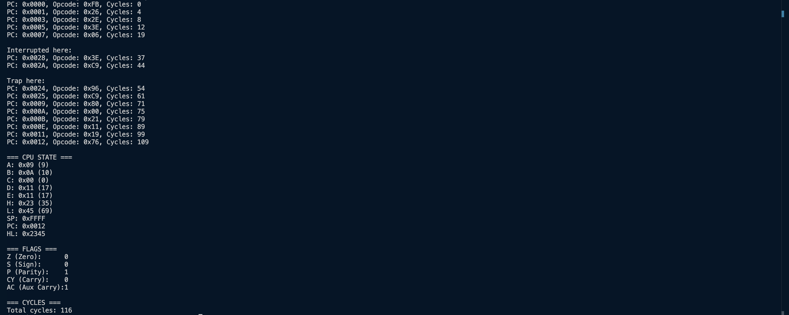
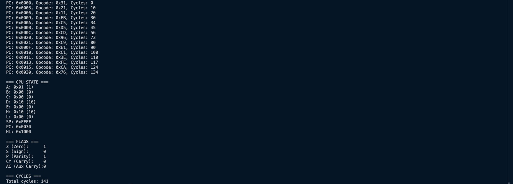
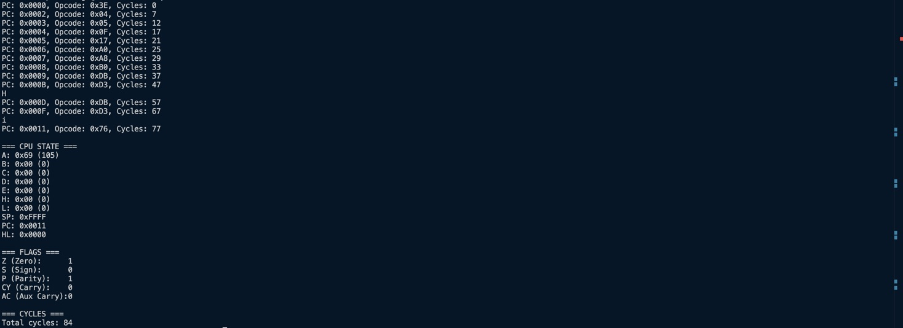

# Intel 8080 Emulator in C

A cycle-accurate emulator for the Intel 8080 CPU, built from scratch to explore the foundations of processor architecture and low-level execution. This project includes full instruction decoding, stack and interrupt handling, and a suite of test programs with visual logs.
I spent over a month building this project, and I'm proud to share it with you.


# 🧠 Human Side — Motivation & Highlights
## 🎯 Why I Built This Emulator
I wanted to understand what a processor really is — not just conceptually, but practically. The Intel 8080 felt like the perfect place to start: it’s one of the earliest widely adopted CPUs, and it laid the groundwork for modern computing. By emulating it, I could explore where it all began — how instructions are executed, how memory is accessed, and how control flow is managed at the hardware level.

This project was my way of demystifying the CPU. I wanted to see how each opcode translates into behavior, how flags are affected, and how the stack and interrupts interact with execution. It wasn’t just about building something — it was about understanding the essence of computation.

## 🧱 The Hardest Part
The most challenging aspect was stitching everything together into a coherent, modular, and scalable system. Writing individual components like instruction handlers or memory access was straightforward — but designing an architecture where everything communicates cleanly and can be extended easily took serious planning and iteration.

I wanted the emulator to feel like a real machine, but also like a clean codebase. That meant abstracting complexity without losing fidelity, and making sure every part — from the CPU core to the decoder — could grow as needed.

## 💡 My Favorite Part
The instruction decoder. I built a system that maps opcodes directly to instruction handlers, so adding new instructions was as simple as writing a few lines of code. It turned what could have been a tedious process into something elegant and satisfying. Watching the CPU execute new instructions just moments after adding them to the table was incredibly rewarding.

Let me know if you want to adjust the tone or add a short intro sentence at the top. Otherwise, we’re ready to move on to the Tech Side whenever you are.

# ⚙️ Technical Side — Architecture, Execution & Demo
## 🧩 What It Is
This is a cycle-accurate emulator for the Intel 8080 CPU, written entirely in C. It simulates the behavior of the processor at the instruction level, including:
- Full instruction decoding and execution
- Register and flag updates
- Stack operations (PUSH, POP, CALL, RET)
- Interrupt handling (EI, DI, RST, TRAP)
- Cycle tracking per instruction
- Memory access and program loading
- Trap detection and logging

The goal was to build a minimal yet complete emulator that behaves like the real 8080 — not just in terms of output, but in how it gets there.

## 🔍 Why the Intel 8080?
The Intel 8080 is one of the earliest general-purpose microprocessors, and it laid the foundation for the x86 architecture. Emulating it is like stepping into the roots of modern computing. It’s simple enough to implement without external dependencies, but rich enough to teach:
- Instruction decoding
- Flag logic
- Memory addressing
- Control flow
- Interrupt architecture

It’s also historically significant — powering systems like the Altair 8800 and early CP/M machines.

# 🛠️ How It Works (Brief Overview)
## 🧠 CPU Core
- Registers: A, B, C, D, E, H, L, SP, PC
- Flags: Zero, Sign, Parity, Carry, Aux Carry
- Cycle counter: updated per instruction
- Instruction decoder: maps opcodes to handler functions

## 📦 Memory
- 64KB flat memory space
- Program loaded into memory at address 0x0000
- Interrupt and trap handlers mapped to fixed vectors

## 🔁 Execution Loop
Fetch -> Decode -> Execute

Each instruction updates registers, flags, memory, and cycles

Special instructions (HLT, CALL, RET, JMP, etc.) alter control flow

Interrupts and traps can also be triggered

## 🧩 Decoder Design
The decoder is built as a lookup table that maps each opcode to its corresponding handler. This makes the architecture modular and scalable — adding a new instruction is as simple as writing a handler and registering it.

# 🧪 Demo: Some Test Programs
## Test #1:
```
uint8_t program[] = {
    0xFB,       // EI
    0x26, 0x30,
    0x2E, 0x00,
    0x3E, 0x05, // MVI A 
    0x06, 0x0A, // MVI B
    0x80,       // ADD B
    0x00,       // NOP
    
    0x21, 0x34, 0x12, // LXI H, 0x1234
    0x11, 0x11, 0x11, // LXI D, 0x1111
    0x19,             // DAD D
    0x76              // HLT
};

uint8_t interrupt_handler[] = {
    0x3E, 0xFF, // MVI A, 0xFF
    0xC9        // RET
};

uint8_t trap_handler[] = {
0x96,
0xC9            // RET
};
```
## Result:


## Test #2:
```
uint8_t program[] = {
    0x31, 0xFF, 0xFF,     // LXI SP, 0xFFFF
    0x21, 0x00, 0x10,     // LXI H, 0x1000
    0x11, 0x01, 0x10,     // LXI D, 0x1001
    0xEB,                 // XCHG (HL <-> DE)
    0xC5,                 // PUSH B
    0xD5,                 // PUSH D
    0xCD, 0x20, 0x00,     // CALL 0x0020
    0xE1,                 // POP H
    0xC1,                 // POP B
    0x3E, 0x01,           // MVI A, 0x01
    0xFE, 0x01,           // CPI 0x01
    0xCA, 0x30, 0x00,     // JZ 0x0030 HLT
};
```
## Result:


## Test #3:
```
uint8_t program[] = {
        0x3E, 0x0F,           // MVI A, 0x0F
        0x04,                 // INR B
        0x05,                 // DCR B
        0x0F,                 // RRC
        0x17,                 // RAL
        0xA0,                 // ANA B
        0xA8,                 // XRA B
        0xB0,                 // ORA B
        0xDB, 0x01,           // IN 0x01
        0xD3, 0x02,           // OUT 0x02
        0xDB, 0x01,
        0xD3, 0x02,
        0x76                  // HLT
};
```
## Result:


# 🚀 How to Run
## 🧱 Requirements:
- C compiler
- Terminal or shell environment

## 💻 Example command:
`clang [all files are need to be compiled] -o [your name of compiled file]`

## 🎊 Run:
`./[name of compiled file]`

## 💡 Tip:
I highly recommend to use CMake, it's versatile and comfortable
method to run projects. CMakeLists.txt is ready to use.